<p align="center"></p>

# Poche

PWA mobile de **capture rapide de tâches** (texte, voix, photo), qui fonctionne entièrement hors ligne et
envoie les captures vers **Orqea** dès que le réseau revient.

- Capture en 3 secondes : un champ, un bouton. Voix, photo, échéance et priorité en un geste.
- Boîte de réception locale (IndexedDB) : statut en attente / envoi / envoyée / échec avec raison, édition, suppression, tri.
- File d'envoi persistante : Background Sync si disponible, sinon au retour du réseau / au premier plan ;
  backoff exponentiel ; **idempotence par `clientId`** (une capture ne crée jamais deux cartes).
- Partage entrant (Web Share Target), raccourcis d'application « Nouvelle tâche » et « Photo ».
- fr / en, thème clair / sombre / système, accessible (lecteur d'écran, cibles ≥ 44 px).

## Installation

```bash
npm ci
npm run mock      # faux serveur Orqea sur http://localhost:4010
npm run dev       # app sur http://localhost:5173 (proxy /api → mock)
```

Jeton accepté par le mock : `orqea_pat_0123456789abcdef0123456789abcdef0123456789abcdef0123456789abcdef`.
Réglages → coller le jeton → choisir tableau et liste.

| Commande                                | Rôle                                                                 |
| --------------------------------------- | -------------------------------------------------------------------- |
| `npm run build` / `npm run preview`     | build de production (service worker actif) / aperçu                  |
| `npm run lint` / `npm run format:check` | ESLint strict (typescript-eslint strict + a11y) / Prettier           |
| `npm run typecheck`                     | TypeScript                                                           |
| `npm test` / `npm run coverage`         | Vitest + Testing Library ; la couverture exige **100 % par fichier** |
| `npm run e2e`                           | Playwright mobile (Pixel 7) : build + mock lancés automatiquement    |
| `npm run check:size`                    | aucun fichier source > 1000 lignes                                   |
| `npm run icons`                         | régénère les PNG à partir de `public/logo.svg`                       |

Exclus de la couverture unitaire (points d'entrée, couverts par les tests E2E) : `src/main.tsx`,
`src/sw.ts`, `mock-orqea/server.ts`. Toute la logique qu'ils appellent est testée unitairement.

### Configuration

| Variable             | Défaut                                      | Effet                                                     |
| -------------------- | ------------------------------------------- | --------------------------------------------------------- |
| `VITE_ORQEA_API_URL` | `""`                                        | URL de base de l'API Orqea ; `""` = même origine          |
| `MOCK_ORQEA_URL`     | `http://localhost:4010`                     | cible du proxy `/api` en dev / preview                    |
| `VITE_ORQEA_APP_URL` | `http://localhost:3001` en local, sinon `/` | URL de l’application Orqea (bouton « Revenir sur Orqea ») |

### Le mock Orqea (`mock-orqea/`)

Serveur Express, données en mémoire (3 tableaux dont un chiffré, 5 listes). Variables :

| Variable           | Défaut           | Effet                                                                    |
| ------------------ | ---------------- | ------------------------------------------------------------------------ |
| `MOCK_PORT`        | `4010`           |                                                                          |
| `MOCK_TOKEN`       | voir ci-dessus   | jeton accepté                                                            |
| `MOCK_MODES`       | —                | liste parmi `slow,401,402,403,404,429,5xx` (`403` = refus `TOKEN_SCOPE`) |
| `MOCK_SLOW_MS`     | `3000`           | délai du mode `slow`                                                     |
| `MOCK_ERROR_RATE`  | `0.5`            | probabilité d'une 503 en mode `5xx`                                      |
| `MOCK_402_CODE`    | `FEATURE_LOCKED` | ou `PLAN_LIMIT`                                                          |
| `MOCK_RETRY_AFTER` | `5`              | secondes, en mode `429`                                                  |
| `MOCK_CORS_ORIGIN` | `*`              |                                                                          |

Ex. : `MOCK_MODES=slow,5xx npm run mock`. À chaud : `POST /__mock/config {"modes":["401"]}`,
`POST /__mock/reset`, `GET /__mock/state` (cartes et pièces jointes créées).

## Contrat `OrqeaClient`

Tout accès à Orqea passe par l'interface [`src/orqea/types.ts`](src/orqea/types.ts). L'implémentation HTTP
tient dans **un seul fichier**, [`src/orqea/httpClient.ts`](src/orqea/httpClient.ts), instancié par
[`src/orqea/index.ts`](src/orqea/index.ts). Brancher le vrai Orqea ne touche que ces fichiers. Un test de
contrat ([`src/orqea/contract.test.ts`](src/orqea/contract.test.ts)) fait tourner le client HTTP réel contre le mock.

```ts
interface OrqeaClient {
  listBoards(): Promise<{ id: string; title: string; encrypted: boolean }[]>;
  listLists(boardId: string): Promise<{ id: string; title: string; position: number }[]>;
  createCard(input: {
    listId: string;
    title: string;
    description?: string;
    dueDate?: string; // date-heure ISO 8601 UTC
    priority?: 'low' | 'normal' | 'high' | 'urgent';
    clientId: string; // UUID généré par Poche
  }): Promise<{ id: string; boardPosition: number }>;
  uploadAttachment(
    cardId: string,
    file: File,
    options?: { clientId?: string },
  ): Promise<{ url: string }>;
}
```

| Route HTTP (préfixe `/api/v1`) | Méthode | Corps / réponse                                                                                                                                        |
| ------------------------------ | ------- | ------------------------------------------------------------------------------------------------------------------------------------------------------ |
| `/boards`                      | GET     | → `Board[]`                                                                                                                                            |
| `/boards/:boardId/lists`       | GET     | → `BoardList[]` ; 404 si inaccessible ou chiffré                                                                                                       |
| `/cards`                       | POST    | JSON `CreateCardInput`, en-tête `Idempotency-Key: <clientId>` → 201 `{id, boardPosition}` ; **200 avec la même carte** si le `clientId` est déjà connu |
| `/cards/:cardId/attachments`   | POST    | multipart, champ `file`, en-tête `Idempotency-Key: <id pièce jointe>` → 201 `{url}`                                                                    |

Authentification : `Authorization: Bearer orqea_pat_<64 hex>`. Le jeton n'apparaît jamais dans une URL ni
dans un log ; il est stocké chiffré (AES-GCM 256, clé WebCrypto **non extractible** conservée dans IndexedDB) et
« Oublier ce jeton » efface le chiffré et la clé.

| Réponse      | Comportement de Poche                                                                                                   |
| ------------ | ----------------------------------------------------------------------------------------------------------------------- |
| 401          | file suspendue, capture conservée, écran « Reconnexion nécessaire »                                                     |
| 402          | échec définitif ; message i18n selon `code` (`FEATURE_LOCKED`, `PLAN_LIMIT`, sinon générique) — jamais le texte serveur |
| 403/404      | échec « tableau ou liste inaccessible »                                                                                 |
| 429          | nouvelle tentative après `Retry-After` (secondes ou date HTTP), file mise en pause                                      |
| 5xx / réseau | backoff exponentiel 2 s → 15 min avec gigue ; échec « trop de tentatives » après 8 essais, relance manuelle possible    |

Un tableau `encrypted: true` est affiché grisé « non pris en charge » et ne peut pas être choisi.

## À ajouter côté Orqea

1. **Jetons personnels (PAT)** `orqea_pat_<64 hex>` : création / révocation par l'utilisateur, acceptés en
   `Authorization: Bearer` sur les routes ci-dessus, avec une portée limitée à la lecture des tableaux/listes
   et à la création de cartes et pièces jointes.
2. **Routes** `GET /api/v1/boards`, `GET /api/v1/boards/:id/lists`, `POST /api/v1/cards`,
   `POST /api/v1/cards/:id/attachments`, avec les formats ci-dessus.
3. **Idempotence par `clientId`** sur `POST /cards` : contrainte d'unicité `(utilisateur, clientId)` ; une
   requête rejouée renvoie la carte existante (200) au lieu d'en créer une seconde, même si la première
   réponse s'est perdue.
4. **Idempotence des pièces jointes** : voir [docs/idempotence-pieces-jointes.md](docs/idempotence-pieces-jointes.md) (question ouverte).
5. **Erreurs** : 402 avec `{ "code": "FEATURE_LOCKED" | "PLAN_LIMIT" }`, 429 avec `Retry-After`, CORS
   si l'app est servie depuis une autre origine (`Authorization`, `Idempotency-Key` autorisés, `Retry-After` exposé).
6. **Champs de carte** : `dueDate` (ISO 8601 date-heure) et `priority` (`low|normal|high|urgent`).

## Architecture

```
src/
  orqea/        contrat, client HTTP, erreurs normalisées, clés i18n d'erreur
  storage/      IndexedDB (idb), coffre du jeton (WebCrypto)
  captures/     modèle, dépôt local, tri, échéances
  sync/         file d'envoi (verrou Web Locks), backoff, planificateur, Background Sync
  destinations/ cache hors ligne des tableaux / listes
  share/        Web Share Target (brouillons)
  media/        compression photo (≤ 1600 px, WebP sinon JPEG), dictée / mémo vocal
  i18n/ theme/ hooks/ components/ views/
  sw.ts         service worker (précache Workbox, navigation hors ligne, partage, sync)
mock-orqea/     faux serveur Orqea
e2e/            Playwright mobile
```

Choix notables :

- **Échéance rapide** : « Aujourd'hui » = 18 h (23 h 59 si déjà passé), « Demain » = 9 h, heure locale.
- **Voix** : Web Speech API si disponible (Chrome, Safari) ; sinon enregistrement audio joint à la carte
  (pas de transcription côté serveur).
- **Édition** : possible tant que la carte n'existe pas encore dans Orqea.
- **Lighthouse PWA** : la catégorie a été retirée de Lighthouse 12 ; les mêmes critères (manifest
  installable, icônes dont maskable, service worker, fonctionnement hors ligne, raccourcis, partage) sont
  vérifiés par `e2e/pwa.spec.ts`.
